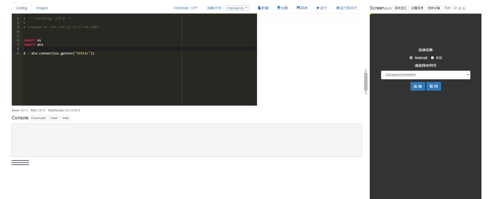

## Intro
Web-based visual editor for generating atx testcase.

## Dependency
- atx (https://pypi.python.org/pypi/atx/)
- futures (https://pypi.python.org/pypi/futures/)
- tornado (https://pypi.python.org/pypi/tornado/)

## Installation
using pip:
```
$ pip install -U atx-webide
```

or clone this repository and run:

```python setup.py install```

if you got "TypeError: decoding Unicode is not supported" in easy_install,
run ```pip install -U setuptools``` first.

## Usage
```
$ python -m atxweb
```


It will start the server and open the web browser. Just do as follows:

1. choose & connect device,
2. edit blocks,
3. click **刷新** to refresh screen, click **运行/单步运行** to run/run step,
4. when no blocks are selected, draw rect on screen and click **保存选区** to save cropped screen region,
5. **Python** tab shows the generated code, **Images** tab shows the cropped images,
6. when running, output will be show at **console**,
7. click **保存** to save the workspace (actually changes will be saved when changing tabs, so it's not nessesary most of time).

Have Fun!

## Refs
1. [ATX (AutomatorX)](https://github.com/codeskyblue/AutomatorX)
2. [atx-blockly](https://github.com/openatx/blockly)
3. [How to test BoomBeach with atx (@testerhome)](https://testerhome.com/topics/5923)
